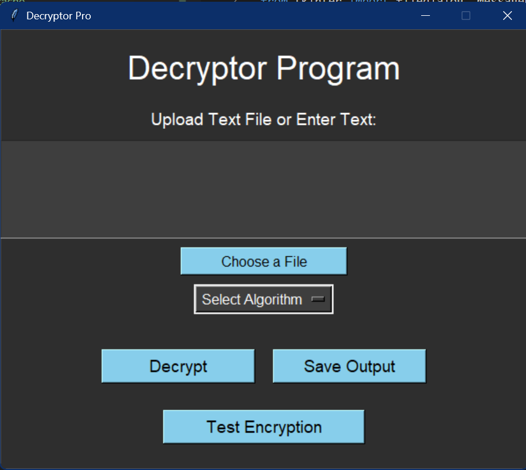
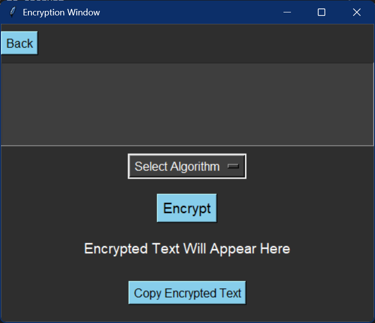

---

# Decryptor Application

## Overview

This **Decryptor Application** is a GUI-based tool built using Python's **Tkinter** library. It allows users to decrypt and encrypt text using various classical cryptography algorithms. The app provides a user-friendly interface for testing different encryption and decryption methods and saving the results to a text file.

### Key Features

- **Decryptor Tool**: Choose from a set of algorithms to decrypt an encrypted text.
- **Encryptor Tool**: Test encryption methods by entering text and choosing the desired encryption algorithm.
- **File Upload Support**: Upload a text file containing the encrypted message for decryption.
- **Result Export**: Save the decrypted output as a text file to a selectable location.
- **Copy to Clipboard**: Easily copy encrypted results to your clipboard for further use.
- **Dark Theme UI**: Aesthetic dark-themed interface with sky blue buttons for easy navigation.
- **Fixed-size Window**: Clean and neatly arranged fixed-size window layout for consistent user experience.

## Project Structure

```bash
DecryptorApp/
├── algorithms.py      # Contains all encryption and decryption logic
├── main.py            # Main application file with Tkinter GUI
├── README.md          # Project description and instructions (this file)
├── requirements.txt   # List of dependencies for the project
└── venv/              # (optional) Virtual environment directory
```

## Algorithms Implemented

The application supports the following classical encryption/decryption algorithms:

1. **Caesar Cipher**
2. **Rail Fence Cipher**
3. **Row Matrix**
4. **Substitution Cipher**
5. **Vigenère Cipher**

## Setup Instructions

### Prerequisites

Make sure you have Python installed on your machine. You can download it from [here](https://www.python.org/downloads/).

### Step 1: Clone the Repository

```bash
git clone https://github.com/Nawin-10/DecryptorApp.git
cd DecryptorApp
```

### Step 2: Create a Virtual Environment (Optional but Recommended)

```bash
python -m venv venv
source venv/bin/activate       # On Windows: venv\Scripts\activate
```

### Step 3: Install Dependencies

```bash
pip install -r requirements.txt
```

The requirements include the necessary libraries, such as Tkinter (which is part of the standard Python library).

### Step 4: Run the Application

To launch the application, run:

```bash
python main.py
```

This will open the main interface of the Decryptor Application.

## How to Use

### Decryption

1. **Upload a File**: Use the "Upload Text File" button to load an encrypted text file.
2. **Enter Text Manually**: Alternatively, you can enter the encrypted text directly in the text box.
3. **Select Algorithm**: Choose one of the available algorithms from the dropdown menu.
4. **Decrypt**: Click the "Decrypt" button to see the decrypted text.
5. **Save Output**: Save the decrypted result to a text file using the "Save Output" button.

### Encryption Testing

1. **Test Encryption**: Click the "Test Encryption" button to open a new window.
2. **Enter Text**: Input the text you want to encrypt.
3. **Select Algorithm**: Choose an encryption algorithm from the dropdown menu.
4. **Encrypt**: Click the tick mark to generate the encrypted text.
5. **Copy Encrypted Text**: Use the "Copy" button to copy the encrypted result to your clipboard.
6. **Back**: Use the "Back" button to return to the main window.

## Screenshots

**Main Window:**



**Encryption Window:**



## Future Enhancements

1. Add more encryption and decryption algorithms, such as DES, AES, or RSA.
2. Implement additional functionalities like logging and error handling for invalid inputs.
3. Provide more customization options for encryption (e.g., dynamic key input).

## License

This project is open source and available under the [MIT License](LICENSE).

## Contact

For questions or collaboration inquiries, reach out via:

- **GitHub**: [Nawin-10](https://github.com/Nawin-Cyber-10)
- **LinkedIn**: [Nawin Prasath](https://www.linkedin.com/in/nawin10)

---

Feel free to customize further if needed!
